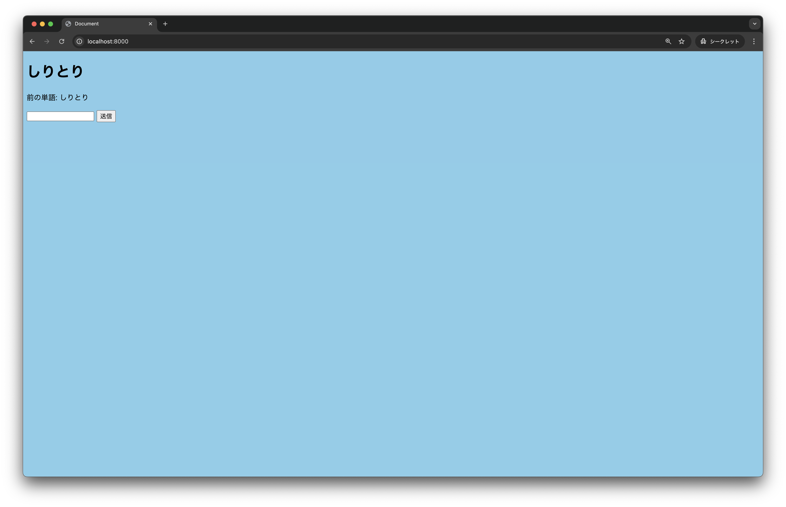

## しりとりアプリをレベルアップしてみよう

### はじめに

まずはこのリポジトリのプロジェクトを動かしてみましょう

```
cd src
deno run -A --watch server.js
```

コンソールに表示されるlocalhostにアクセスすると以下の画面が出ているはずです


しりとりできていることを確認しましょう

## しりとりアプリをレベルアップしてみよう！
今回の勉強会では以下の機能実装についてチャレンジします

- **スコア換算**
  - 入力した単語の文字数分のスコア獲得
  - 累計スコア表示
  - 使用単語数カウント


- **ランキング画面**
  - プレイヤー名とスコアを記録
  - トップ10のランキング表示
  - モード別スコア表示


- **縛りプレイモード**
  - **重複禁止**: 一度使った単語は再使用不可
  - **制限時間**: 設定した時間内でプレイ
  - **縛りプレイ**: 重複禁止＋制限時間の組み合わせ


## 実装編
それではさっそく作っていきましょう

今回の勉強会では特にスタイリングについてはこだわりません、各自自由にカスタマイズしてみましょう

### スコア換算
ゲームスタート、リセット機能をつけます

ゲームコントローラー用にスタートリセットボタンを設置する箇所を作ります

ゲームスタートを押したら解答欄のDOMを表示、リセットで解答欄を非表示するようにします

次に、スコアを表示するようにします。今回は繋がった単語の数をカウントするようにしましょう

「ん」がついた単語を送った時にスコアをサーバーに送信します

### ランキング実装
ランキングを表示するDOMを用意します

server.jsから受け取った値をindex.htmlに保存します

### 縛りプレイモード
タイマー機能を実装してみましょう
今回はフロント側でタイマーを実装します


## 発展編
時間が余ったらチャレンジしてみようのコーナーです
- 単語の自動生成
    - gemini APIなどを使ってみましょう
- 通信対戦できるようにする
    - websocketでチャレンジしてみましょう


